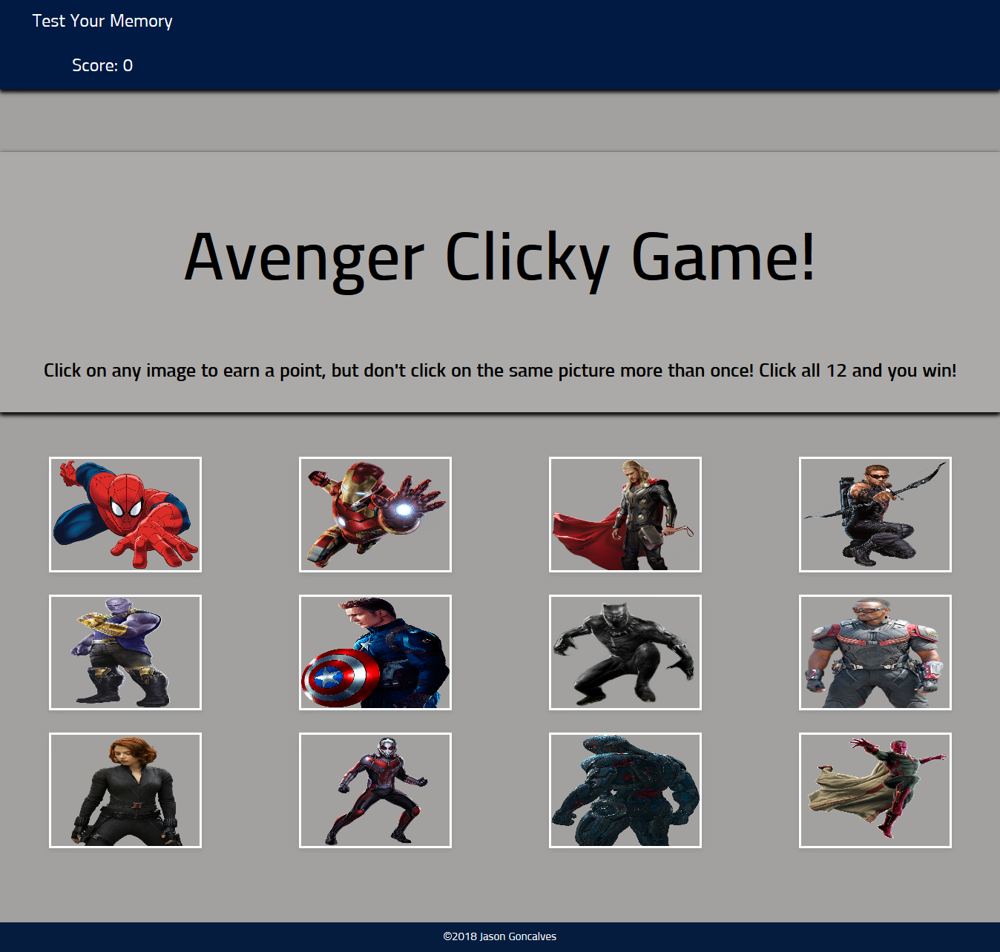

# :controler: Avenger Clicky!

### Overview
A simple memory game built with React, HTML5, and CSS3

### Functionality
For this app, I created a memory game with React. This app break up the application's UI into components, manage component state, and respond to user events.

Built using [create-react-app](https://github.com/facebook/create-react-app 'create-react-app').

Feel free to visit and play the game at [https://stark-bastion-11378.herokuapp.com/](https://stark-bastion-11378.herokuapp.com/ 'Game Link')

### Screenshots

#### Jason Goncalves &copy; 2018
